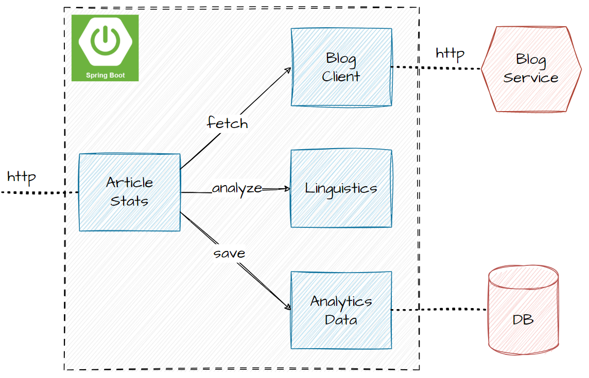

# Mockito in 120 Minutes


## 1. Overview

In this mini-course, we’ll work through a simple Java application consisting of four core components. While it's built using Spring Boot, our focus won’t be on Spring-specific features. Instead, we’ll explore how these components interact with one another and external systems, all through the lens of testing and mocking.

The application we're testing fetches _Article_ data from a REST API using the `blog` component. This data is then analyzed by the `linguistics` module, which tokenizes the content and calculates word frequency. Next, the classes form the `analytics` package store some of the results in a persistent location (for simplicity, the file system). Finally, the entire process is orchestrated by the article `stats` component, which also exposes an HTTP endpoint to trigger this workflow:



As we can see, the components from the diagram map directly to the package structure of our application, along with their relationships.

> **TODO**: Dive into the source code and explore how the modules interact with each-other.

We can start the application  
If you are using Intellij 


## 2. Unit Testing with JUnit5 

Although a basic understanding of unit testing is a prerequisite for this mini-course, let’s warm up with a simple JUnit test. 

The static method BagOfWords::getWords takes two String parameters: the article's title and content. It then splits them by spaces (" ") and new lines ("\n"), merges the results, and returns all the words from this process:

```java
static List<String> getWords(String title, String content) {
    //...
}
```
Let's write a JUnit5 test to verify the correct working of the _getWords_ function:

```java
@Test
void test() {
    List<String> tokens = BagOfWords.getWords("Learn Mockito", "Mockito is a\ntesting framework");
    
    assertThat(tokens)
        .containsExactlyInAnyOrder("Learn", "Mockito", "Mockito", "is", "a", "testing", "framework");
}
```
We use JUnit5’s _@Test_ annotation for the test methods, and the [AssertJ](https://assertj.github.io/doc/#assertj-core) library for assertions, which simplifies verifying elements in the resulting list.

> **TODO**: Study the _BagOfWords::analyze_ function, and once you understand its functionality, write unit tests for it! 

> AssertJ offers a great API for asserting on Map objects, so give it a try!
    For eg: _Assertions.assertThat(resultedMap).containsEntry("Mockito", 2L)_